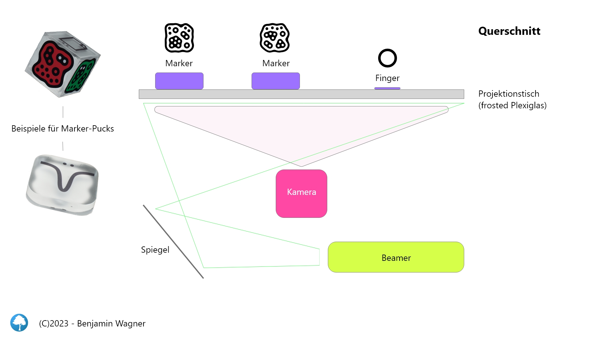
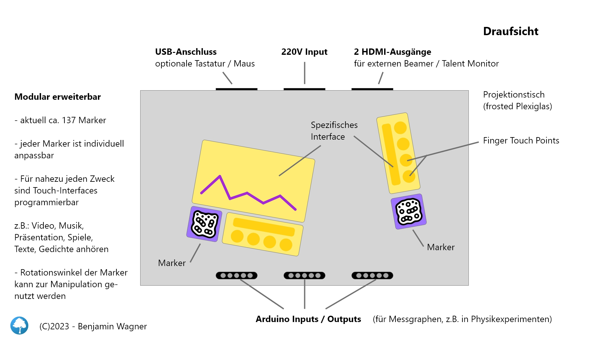

# iVision Hardware

1. Bauplan
2. Interface

## Bauplan

Der schematische Aufbau ist relativ simpel. Er umfasst eine Tischplatte, die
aus frosted Plexiglas besteht, sowie eine Kamera (IR 850 nm) und einen Beamer,
der das optische Feedback durch Rückprojektion auf der Tischplatte anzeigt.

## Interface

Die Arbeitsfläche dient einerseits zur Erfassung der Marker durch eine unter dem Tisch
angebrachte Kamera und andererseits wird ein Feedback projiziert, dass dem Vortragenden
Informationen über Position und Rotationswinkel gibt.

Je nach Marker-Typ kann das Feedback zusätzliche Eingabefelder enthalten. Etwa eine
Mediaplayer-Steuerung oder ein Folienindikator.

### Präsentationsfolien

